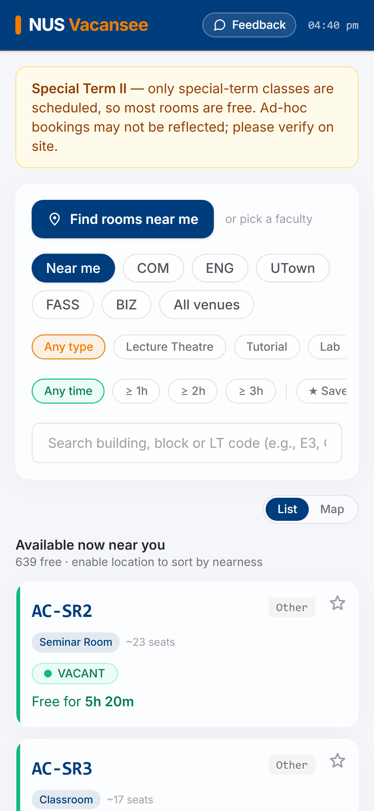
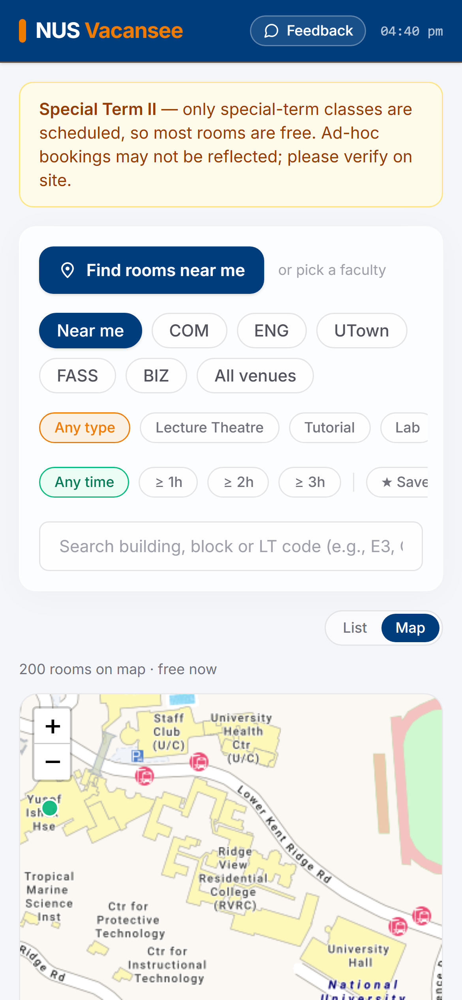
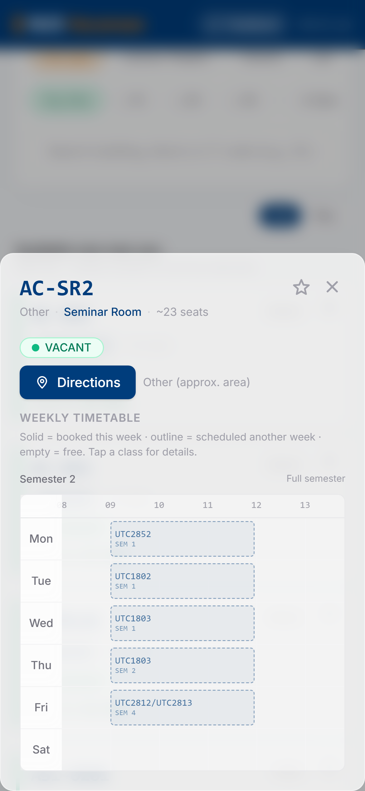

<div align="center">
  
  <h1>NUS Vacansee</h1>
  <p><em>Find your free room nearby.</em></p>
  <p>Find available rooms on the NUS campus in real time — ranked by how near they are to you.</p>

  <a href="https://nus-vacansee.vercel.app/"><strong>nus-vacansee.vercel.app →</strong></a>

  <br/><br/>

  [](LICENSE)
  
  
  
</div>

<br/>

<p align="center">
  
  &nbsp;&nbsp;
  
  &nbsp;&nbsp;
  
  &nbsp;&nbsp;
  
</p>

---

## Why we built this

Between classes, students constantly need a spot to study, take a call, or work
on a group project — but there's **no easy way to know which rooms near you are
actually free right now.** You end up wandering corridors, peeking through door
windows, or camping in a crowded study area.

**NUS Vacansee** solves that pain point. It reads NUS class timetables, figures
out which venues have no class on at this exact moment, and shows you the
**nearest free rooms first** — with how long they'll stay free, what kind of room
it is, roughly how many seats, and one-tap directions.

## Features

| Feature | Description |
|---|---|
| **Available now, near you** | Auto-detects your location and lists currently vacant rooms ranked by distance + how long they stay free |
| **Live status** | Vacant / occupied / busy, computed from the local clock, refreshed every 30 s |
| **Map view** | Free-room pins on a OneMap basemap with NUS building names; tap a pin for details and directions |
| **Directions** | Opens the room's exact location in Google Maps |
| **Weekly timetable** | A NUSMods-style grid per venue with a "now" line |
| **Filters & search** | Faculty cluster, room type (lecture theatre / tutorial / lab / seminar / classroom), free-for ≥ 1 h/2 h/3 h, and fuzzy venue search |
| **Favorites & recents** | Save go-to rooms for one-tap access |
| **Installable PWA** | Works offline with a cached snapshot; add to your home screen on iOS / Android |

## How it works

NUS Vacansee is **fully client-side — there is no backend.**

1. The browser fetches NUS data directly:
   - **Availability:** NUSMods `venueInformation.json` (per-semester class
     schedules), and
   - **Locations:** NUSMods `venues.json` (per-venue coordinates, room name, floor).
2. It **normalizes** that into a venue → schedule matrix, infers room type and an
   approximate capacity, and maps each venue to a faculty cluster.
3. **Occupancy is computed in the browser** using Singapore local time against the
   current semester + teaching week.
4. Data is **cached** (IndexedDB, stale-while-revalidate ~12h) with a bundled
   static snapshot as an offline fallback, and a service worker caches the app
   shell.

This keeps it zero-cost to run and respectful of the NUSMods API (data is fetched
at most ~once per 12 hours and cached).

## Tech stack

- **Next.js 16** (App Router, React 19), deployed on **Vercel**
- **Tailwind CSS v4**, glassmorphic design with NUS corporate colors
- **Leaflet / react-leaflet** with **OneMap** tiles for the map
- TypeScript, no server / no database

## Getting started

```bash
npm install
npm run dev      # http://localhost:3000
npm run build    # production build
```

### Environment variables (optional)

Copy `.env.example` to `.env.local` and set the feedback endpoint:

```bash
# Create a free form at https://formspree.io (or Tally) and paste its POST URL
NEXT_PUBLIC_FEEDBACK_ENDPOINT=https://formspree.io/f/your-id
# Optional fallback when no endpoint is set: opens the user's mail client
NEXT_PUBLIC_FEEDBACK_EMAIL=you@example.com
```

On Vercel, add the same variables under Project → Settings → Environment Variables.

## Feedback

Use the **"Send feedback"** link in the app footer to report a wrong room status
or suggest a feature. Submissions post to the configured form endpoint (or open
your mail client as a fallback).

## Data sources & Acknowledgements

This is an **independent, student-built project — not affiliated with, endorsed
by, or operated by the National University of Singapore.**

### NUSMods
Room availability and venue locations come from [NUSMods](https://nusmods.com):

- **Availability:** `https://api.nusmods.com/v2/{acadYear}/semesters/{sem}/venueInformation.json`
- **Locations / room names / floors:** `venues.json` from the
  [`nusmodifications/nusmods`](https://github.com/nusmodifications/nusmods) repo
- **Academic calendar:** the semester / teaching-week / recess-reading-exam logic
  in `src/lib/calendar.ts` is **ported from NUSMods'
  [`nusmoderator`](https://github.com/nusmodifications/nusmods/tree/master/packages/nusmoderator)
  package** (MIT), so week numbering matches NUSMods exactly.

NUSMods provides a public API and asks that it be used responsibly — this app
fetches at most once per ~12h, caches client-side, and ships a static fallback.
NUSMods and its `nusmoderator` package are distributed under the MIT License:

```
The MIT License (MIT)

Copyright (c) 2014 - Present, NUSModifications

Permission is hereby granted, free of charge, to any person obtaining a copy
of this software and associated documentation files (the "Software"), to deal
in the Software without restriction, including without limitation the rights
to use, copy, modify, merge, publish, distribute, sublicense, and/or sell
copies of the Software, and to permit persons to whom the Software is
furnished to do so, subject to the following conditions:

The above copyright notice and this permission notice shall be included in all
copies or substantial portions of the Software.

THE SOFTWARE IS PROVIDED "AS IS", WITHOUT WARRANTY OF ANY KIND, EXPRESS OR
IMPLIED, INCLUDING BUT NOT LIMITED TO THE WARRANTIES OF MERCHANTABILITY,
FITNESS FOR A PARTICULAR PURPOSE AND NONINFRINGEMENT. IN NO EVENT SHALL THE
AUTHORS OR COPYRIGHT HOLDERS BE LIABLE FOR ANY CLAIM, DAMAGES OR OTHER
LIABILITY, WHETHER IN AN ACTION OF CONTRACT, TORT OR OTHERWISE, ARISING FROM,
OUT OF OR IN CONNECTION WITH THE SOFTWARE OR THE USE OR OTHER DEALINGS IN THE
SOFTWARE.
```

A big thank-you to the NUSMods team and contributors for maintaining this public
resource for NUS students.

### OneMap (Singapore Land Authority)
Map tiles are © [OneMap](https://www.onemap.gov.sg/) / Singapore Land Authority,
used with attribution per the OneMap terms of use.

### Other
[Leaflet](https://leafletjs.com/) / react-leaflet for map rendering;
Next.js / React; deployed on Vercel.

## Disclaimer

Availability is computed from published class timetables and **may not reflect
ad-hoc bookings, events, or closures.** Always verify a room is genuinely free
before relying on it.

## License

[MIT](LICENSE) © NUS Vacansee contributors.

## Contributing

Contributions are welcome! Whether it's a bug report, feature request, or pull request — we appreciate it.

1. Fork the repo
2. Create your feature branch (`git checkout -b feature/cool-feature`)
3. Commit your changes
4. Push to the branch and open a Pull Request

## Star this repo

If Vacansee helped you find a study spot, please consider giving it a star — it helps other NUS students discover it!
